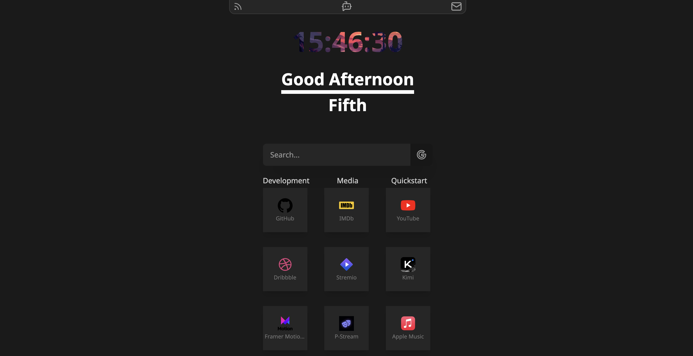

# Startpage

This is my personal startpage for my browser using TypeScript, Svelte, and Tailwind.

## Make your own!
If you are a fan of the startpage, you can customize it to your liking!

### Configuration

Edit `src/config.ts` to customize your startpage:

- **`name`** - Your display name
- **`links`** - Array of bookmark objects with `title` and `url` properties
- **`searchEngines`** - Configure your preferred search providers
- **`theme`** - Color scheme and styling options

### Deploy Your Own

1. **Fork this repository** on GitHub
2. **Edit** `src/config.ts` with your personal settings
3. **Choose your deployment platform:**

#### Cloudflare Pages
- Connect your GitHub repository to [Cloudflare Pages](https://pages.cloudflare.com)
- Build command: `npm run build`
- Output directory: `dist`

#### GitHub Pages
- Go to your repository **Settings** → **Pages**
- Set **Source** to "Deploy from a branch"
- Select **Branch**: `gh-pages` (or `main` if using GitHub Actions)
- Click **Save**
- Your site will be available at `https://yourusername.github.io/startpage`

**Note**: If you're using the included GitHub Actions workflow, it will automatically build and deploy to the `gh-pages` branch when you push changes to `main`